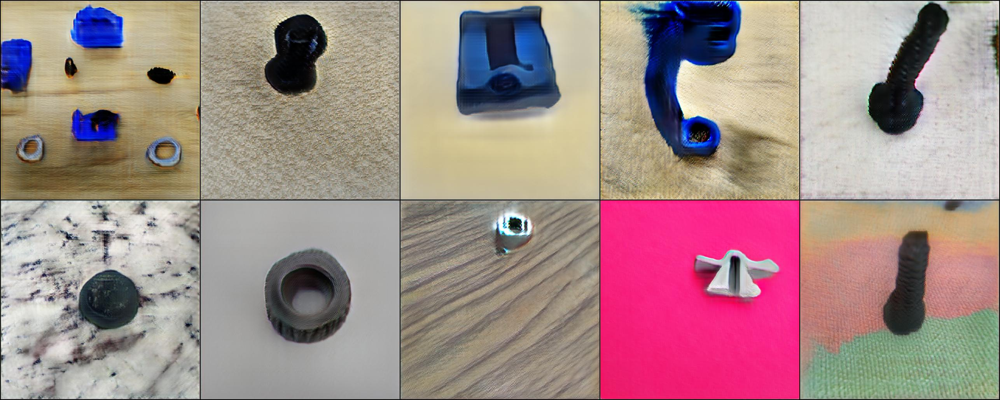
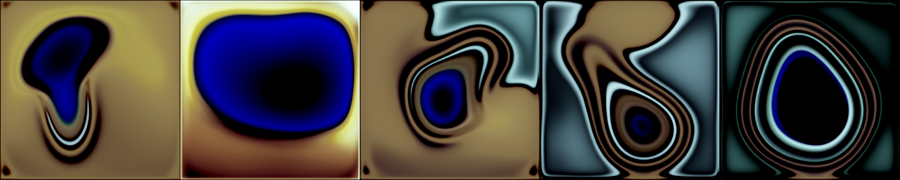
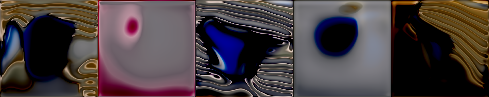
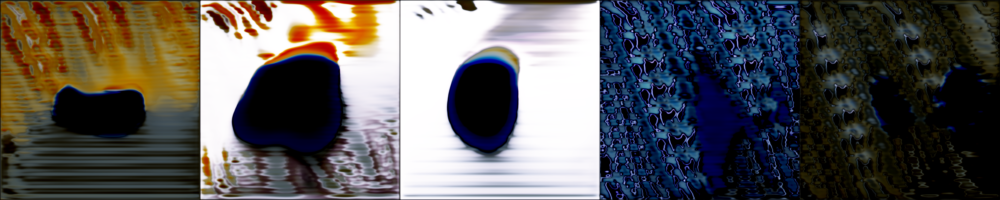
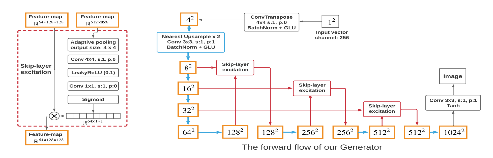
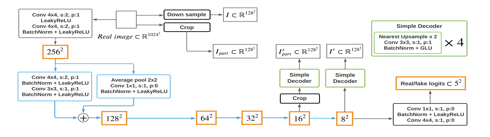
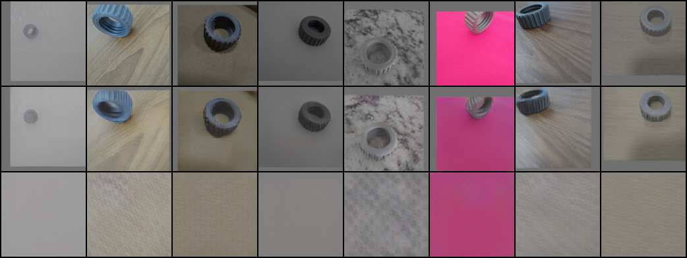

# `Aumento de imagens usando modelos generativos profundos`
# `Image augmentation using deep generative models`

## Apresentação

O presente projeto foi originado no contexto das atividades da disciplina de pós-graduação *IA376L - Deep Learning aplicado a Síntese de Sinais*, 
oferecida no primeiro semestre de 2022, na Unicamp, sob supervisão da Profa. Dra. Paula Dornhofer Paro Costa, do Departamento de Engenharia de Computação e Automação (DCA) da Faculdade de Engenharia Elétrica e de Computação (FEEC).

|Nome  | RA | Especialização|
|--|--|--|
| Pedro A. Vicentini Fracarolli  | 191535  | Analista de Sistemas|
| Mariana Zaninelo Reis| 223752  | Eng. Eletricista|
| Matheus Henrique S. Pinheiro  | 223988  | Eng. Eletricista|

## Resumo (Abstract)
Neste projeto aumentamos um conjunto de dados próprio através de redes generativas profundas - visando melhorar o desempenho de outros algoritmos em outras tarefas usando este conjunto de dados expandido sintéticamente. Contudo, a realização deste projeto nos trouxe um problema denominado *few-shot learning*, que ocorre quando há poucos dados para o treinamento de um modelo profundo. Enfrentamos esse desafio utilizando uma arquitetura de GAN especializada e como métrica de avaliação do nosso projeto usamos CNNs e técnicas de visualização de gradientes para entedermos os efeitos de adicionarmos dados sintéticos a reais.
## Descrição do Problema/Motivação
Modelos generativos profundos atualmente fazem grande sucesso devido aos seus resultados em áreas como geração de texto, áudio e imagens. Porém, analisando o desenvolvimento desses modelos, conseguimos perceber a necessidade de treiná-los com uma grande quantidade de dados, e mesmo assim podem possuir dificuldades na síntese de amostras representativas da distribuição alvo.

Com esse desafio em mente decidimos trabalhar com um pequeno conjunto de dados próprio, usando-o para treinar um modelo que produza dados sintéticos e com isso expandir o nosso conjunto de dados. Esperamos que os dados gerados sejam representativos da distribuição original provando-se úteis no treinamento de modelos de classificação, detecção de objetos, entre outros.

## Objetivo
Nosso grupo teve como meta expandir um pequeno conjunto de dados por meio de amostras sintéticas que sejam estatisticamente semelhantes ao conjunto de dados original, para isso: 
* Amostramos dados sintéticos por meio de uma rede generativa profunda a [GAN](https://arxiv.org/abs/1406.2661);
* Avaliamos os dados gerados por meio de classificações com redes neurais convolucionais;
* Avaliamos as propriedades dos dados gerados por meio de uma técnica de gradientes a [Grad-CAM](https://arxiv.org/abs/1610.02391).

## Metodologia Proposta

### **Base de dados**

Para este trabalho, utilizamos uma base de dados própria que corresponde a imagens de peças que formam uma mini morsa de bancada, conforme ilustrado abaixo:

|  |
|:--:| 
| *Figura 1: Objeto de estudo.   Referência: Imagem própria.* |

O conjunto de dados é originalmente composto por 3000 imagens divididas em 10 classes balanceadas. A figura a seguir ilustra as classes que compõem o nosso conjunto de dados:

|  |
|:--:|
| *Figura 2: Amostra da base de dados.   Referência: Imagem própria.* |

O conjunto de dados pode ser acessado através do seguinte hyperlink: [Imagens](https://drive.google.com/drive/folders/1efljm3fsSU5jd3i0lw46e7y_rgYrkCuo?usp=sharing).

A motivação para a escolha desse conjunto de dados se deu por alguns fatores, sendo eles:

* Não é um conjunto de dados popular e/ou altamente disponível online, possibilitando-nos avaliar os resultados de modelos generativos em uma aplicação mais "real".

* Devido ao conjunto de dados estar rotulado poderemos usar métodos de avaliação mais objetivos.

* Originalmente é um conjunto de dados pequeno, viabilizando-nos a análise do desempenho de modelos generativos nesse tipo de cenário.

### **Abordagem**

O presente trabalho foi realizado em três etapas, sendo elas:

1) **Síntese dos dados**: para amostrarmos e expandirmos o nosso conjunto de dados utilizamos uma arquitetura de GAN conhecida como FastGAN. Entre as diversas arquiteturas de modelos generativos profundo disponíveis a FastGAN destaca-se por ser uma arquitetura que pode operar com poucos dados e não exige muito poder computacional para a sua convergência.

2) **Classificação**: Treinamos uma série de classificadores convolucionais a partir das imagens e de seus rótulos. Mais explicitamente, avaliamos os efeitos de 1. treinar um classificador somente nos dados originais; 2. treinar com os dados originais e técnicas tradicionais de aumento de dados; e 3. treinar com os dados originais e com os dados sintéticos.

3) **Visualização do aprendizado das redes convolucionais**: Uma vez treinada as redes convolucionais para classificação, aplicamos a [Grad-CAM](https://arxiv.org/abs/1610.02391), uma técnica que nos possibilita visualizar as regiões da imagem mais relevantes para o classificador.

### **Avaliação**

Dada a abordagem acima, avaliamos os resultados do nosso experimento por meio de técnicas de classificação em que medimos a acurácia das redes convolucionais e posteriormente confrontamos-las com os padrões de visualização obtidos por meio da técnica Grad-CAM, buscando assim encontrar padrões que relacionem a acurácia e atenção das CNNs - para inferirmos se as amostras sintetizadas possuem as propriedades estatísticas do nosso conjunto de dados.

### **Ferramentas**

Para este trabalho, utilizamos o [PyTorch](https://pytorch.org/) como framework principal e desenvolvemos o código no ambiente [Google Colab](https://colab.research.google.com/).

## Resultados e Discussão

Adaptando a arquitetura da [FastGAN](https://arxiv.org/abs/2101.04775) para as nossas necessidades conseguimos treinar cada classe do nosso conjunto de dados individualmente. Algumas amostras podem ser visualizadas abaixo:

|  |
|:--:|
| *Figura 3: Amostra geradas.   Referência: Imagem própria.* |

As amostras obtidas por meio da rede generativa lembram a estrutura da classe à qual cada uma pertence, porém elas são facilmente distinguíveis como sendo falsas devido a fatores como formas distorcidas, borrões, padrão de cores e etc. Neste trabalho, contudo, não tivemos como objetivo a geração amostras fidedignas em aspectos visuais, mas sim amostras que tragam as propriedades estatísticas de cada classe para que elas sejam úteis para o aumento de um conjunto de dados.

## Conclusão (REFAZER)
A síntese de imagens com um conjunto de dados pequeno e poder computacional limitado é uma tarefa difícil, contudo existe na literatura métodos que se propõem a isso, e adaptando um desses métodos a FastGAN as nossas necessidades fomos capazes de amostrar dados condizentes em aspectos visuais com o nosso conjunto de dados. No entanto ainda há etapas que devemos nos aprofundar e dar prosseguimento como o treinamento de redes neurais para classificação e a utilização de métodos de interpretação dessas redes para averiguarmos se as amostras sintéticas obtidas trazem as propriedades do conjunto de dados original.

## Código
Nesta seção estaremos disponibilizando alguns Colab notebooks para fins de reprodutibilidade do projeto.
* [Treinamento da GAN](https://colab.research.google.com/drive/1PK846mKRrCfe_PLiODZ0799I3LNk2408?usp=sharing)
* [Amostragem da GAN](https://colab.research.google.com/drive/1yy9FwKgEaygtL7mUiQommNEUae0fA5cd?usp=sharing)
* [Como criar o conjunto de dados](https://colab.research.google.com/drive/13SIOthGgAOAEhw1KQfMVNsh2w315_Efi?usp=sharing)*

*Temporários

## Cronograma
|                         |27/04|04/05|11/05|18/05|25/05|02/06|09/06|16/06|23/06|30/06
|-------------------------------|-----|-----|-----|-----|-----|-----|-----|-----|-----|-----
|Revisão Bibliográfica          |X    |    X|    X|    0|    0|     |     |     |     |
|Implementação GAN              |     |     |    X|    #|    #|    #|    #|     |     | 
|Implementação Classificador    |     |     |     |    X|    #|    #|    #|    #|     |
|Implementação da Grad-CAM          |     |     |     |    X|    #|    #|    #|    #|     |
|Relatório Final & Apresentação |     |     |     |     |     |     |     |     |    #|#

- `#` Tempo Planejado
- `X` Tempo Consumido
- `0` Tempo Consumido Além do Esperado  

## Referências Bibliográficas
* [Generative Adversarial Nets](https://arxiv.org/abs/1406.2661)
* [Unsupervised Representation Learning with Deep Convolutional Generative Adversarial Networks](https://arxiv.org/abs/1511.06434)
* [Self-Attention Generative Adversarial Networks](https://arxiv.org/abs/1805.08318)
* [Improved Techniques for Training GANs](https://arxiv.org/abs/1606.03498)
* [Spectral Normalization for Generative Adversarial Networks](https://arxiv.org/abs/1802.05957)
* [Least Squares Generative Adversarial Networks](https://arxiv.org/abs/1611.04076)
* [The Unusual Effectiveness of Averaging in GAN Training](https://arxiv.org/abs/1806.04498)
* [The Unreasonable Effectiveness of Deep Features as a Perceptual Metric](https://arxiv.org/abs/1801.03924)
* [Differentiable Augmentation for Data-Efficient GAN Training](https://arxiv.org/abs/2006.10738)
* [Towards Faster and Stabilized GAN Training for High-fidelity Few-shot Image Synthesis](https://arxiv.org/abs/2101.04775)
* [GANs Trained by a Two Time-Scale Update Rule Converge to a Local Nash Equilibrium](https://arxiv.org/abs/1706.08500)
* [Batch Normalization: Accelerating Deep Network Training by Reducing Internal Covariate Shift](https://arxiv.org/abs/1502.03167)
* [Language Modeling with Gated Convolutional Networks](https://arxiv.org/abs/1612.08083)
* [Grad-CAM](https://arxiv.org/abs/1610.02391)

## Apêndice

### **A** &nbsp; &nbsp; &nbsp; &nbsp; Seleção do modelo de GAN

A síntese de imagens representativas de um conjunto de dados foi o problema central do nosso trabalho, e para resolve-lo foi necessário várias experimentações até alcançarmos o nosso modelo final.

Inicialmente no projeto testamos diferentes modelos generativos como GANs, *Autoenconders* e *Variational Autoenconders*, entretanto não conseguimos obter de nenhum deles amostras fidedignas a nossa distribuição de dados. Porém, analisando os resultados obtidos da GANs, percebemos que elas tentavam aproximar a nossa distribuição alvo contudo não conseguiam convergir a ela.
|  |
|:--:| 
| *Figura 4: Deep Convolutional GAN, época 9.   Referência: Imagem própria.* |

|  |
|:--:| 
| *Figura 5: Deep Convolutional GAN, época 23.   Referência: Imagem própria.* |

|  |
|:--:| 
| *Figura 6: Deep Convolutional GAN, época 39.   Referência: Imagem própria.* |

Dado essa observação fomos mais afundo na literatura de GANs e encontramos diversas arquiteturas e técnicas que motivou-nos a continuar com elas. Abaixo deixamos uma pequena linha do tempo sobre o desenvolvimento das GANs utilizadas.

### 1) Deep Convolutional GAN

Nos primeiros testes desenvolvemos uma GAN com arquitetura convolucional, inspirando nos fortemente em [Unsupervised Representation Learning with Deep Convolutional Generative Adversarial Networks](https://arxiv.org/abs/1511.06434). Entretanto apenas as arquiteturas de maiores resoluções como 512x512 e 1024x1024 pixeis demonstraram resultados, e mesmo assim eram todos semelhantes aos das figuras 4, 5, 6. Além do mais o treinamento era muito instável, devido a escolha de hiperparâmetros e do discriminador que em poucas épocas distinguia facilmente entre as amostras reais e sintéticas consequentemente afetando os gradientes necessários para a atualização das redes. Tentando resolver esses problemas somos levados a próxima etapa.

### 2) Função de perda, ajustes de hiperparâmetros e técnicas de treinamento

Para lidar com os problemas anteriores tentamos algumas modificações nas redes que compõem a GAN, sendo elas:

* Testar várias funções de perda;
* Testar hiperparâmetros e otimizadores;
* Manipular a arquitetura e o modo de treinamento.

E como resultado notamos que:

* As diferentes funções de perda não afetaram a dinâmica de treinamento;
* O otimizador ADAM demonstrou-se ser o mais estável utilizando betas de (0.5, 0.999) ou (0, 0.9) e as taxas de aprendizado de ([0.0001, 0.0004](https://arxiv.org/abs/1706.08500)) para o gerador e discriminador respectivamente. Técnicas como decaimento de taxa de aprendizado pareciam estar degradando o desempenho do modelo.  
* No gerador Nearest Upsampling seguido de Conv2d apresentou resultados semelhantes a Transposed Convolution 2D seguido de Conv2d, mas os recursos computacionais gastos foram menores. Já para funções de ativações a LeakyReLU apresentou um treinamento mais estável que a ReLU.  
Por fim, técnicas como treinar o gerador ou discriminador mais vezes que o outro ou penalizar o discriminador por ser muito confiante em sua predição degradou o treinamento das redes.  

Feito todos esses testes não obtivemos um modelo com uma síntese satisfatória, então partimos para outro modelo.

### 3) FastGAN

Após pesquisar modelos que não demandem grande poder computacional ou enormes quantidades de dados chegamos a [FastGAN](https://arxiv.org/abs/2101.04775), a qual é uma arquitetura que pode produzir imagens de alta resolução e se diferencia das outras GANs por possuir um gerador que faz uso de skip-layer excitation  

|  |
|:--:| 
| *Figura 7: FastGAN generator.   Referência: Towards Faster and Stabilized GAN Training for High-fidelity Few-shot Image Synthesis.* |

e um discriminador que recebe dois autoenconders como forma de regularização e tem como saída um mapa de características 5x5 em que se computa a soft hinge loss.

|  |
|:--:| 
| *Figura 8: FastGAN Discriminador.   Referência: Towards Faster and Stabilized GAN Training for High-fidelity Few-shot Image Synthesis.* |

Usando essa arquitetura obtivemos um treinamento estável, acreditamos que isso ocorra devido as skip-layer excitation fornecendo mais gradientes a todas as camadas do gerador e aos autoenconders que regularizam o discriminador - propiciando uma dinâmica estável de treinamento - além de codificarem uma versão das amostras reais e de suas texturas.

|  |
|:--:| 
| *Figura 9: FastGAN Discriminador.   Referência: Imagem própria.* |

Contudo o modelo se manteve lento para treinar - dado o nosso poder computacional, e sofria de alguns *mode collapse*. Para solucionarmos isso realizamos modificações como substituir funções de ativação por LeakyReLU, usar taxas de aprendizado diferentes e por fim adicionamos uma [convolutional self-attention](https://arxiv.org/abs/1805.08318) nas redes, tudo isso permitiu um treinamento com um batch size maior e mais diversidade de amostras, o [código final](https://github.com/pfracarolli/ia376l/tree/master/src/models) se encontra disponível no repositório.