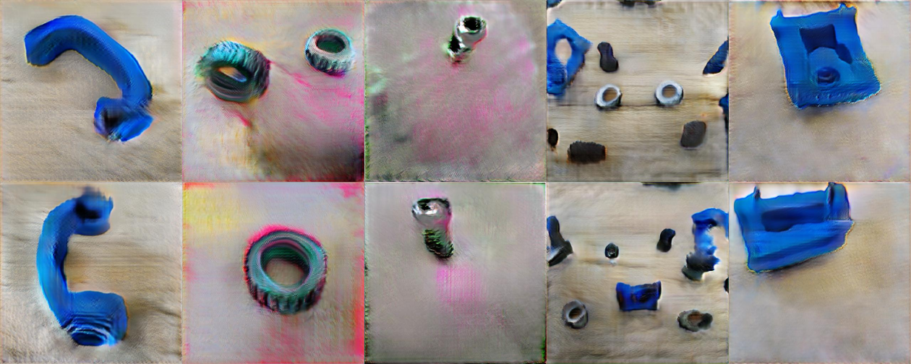

# `Aumento de imagens usando modelos generativos profundos`
# `Image augmentation using deep generative models`

## Apresentação

O presente projeto foi originado no contexto das atividades da disciplina de pós-graduação *IA376L - Deep Learning aplicado a Síntese de Sinais*, 
oferecida no primeiro semestre de 2022, na Unicamp, sob supervisão da Profa. Dra. Paula Dornhofer Paro Costa, do Departamento de Engenharia de Computação e Automação (DCA) da Faculdade de Engenharia Elétrica e de Computação (FEEC).

|Nome  | RA | Especialização|
|--|--|--|
| Pedro A. Vicentini Fracarolli  | 191535  | Analista de Sistemas|
| Mariana Zaninelo Reis| 223752  | Eng. Eletricista|
| Matheus Henrique S. Pinheiro  | 223988  | Eng. Eletricista|

## Resumo (Abstract)
Neste projeto iremos tentar aumentar um conjunto de dados próprio através de uma rede generativa profunda com o objetivo de que o conjunto de dados aumentado propicie um melhor desempenho de outros algoritmos em outras tarefas. Contudo a realização disso nos traz um problema denominado *few-shot learning* que ocorre quando há poucos dados para o treinamento de um modelo profundo. Para enfrentarmos esse desafio de generalização com poucos dados usaremos uma *generative adversarial networks* especializada e avaliaremos nossos resultados através de técnicas como classificação e visualização dos gradientes de redes convolucionais para as amostras geradas.

## Descrição do Problema/Motivação
Modelos generativos profundos para a síntese de sinais atualmente fazem grande sucesso, muito devido aos seus resultados em áreas como geração de texto, áudio e imagens. Porém analisando o desenvolvimento desses modelos conseguimos perceber uma intrínseca necessidade de receberem toneladas de dados para serem treinados e mesmo assim apresentarem dificuldades para a síntese de amostras representativas da distribuição alvo. Essa síntese é agravada ainda mais quando a quantidade de dados utilizada no treinamento é muito pequena pois limita-se a gama de modelos generativos que são capazes de serem utilizados de maneira eficiente.  

Dado todos esses desafios acima decidimos trabalhar com um pequeno conjunto de dados próprio e treina-lo em um modelo que ajude a expandir este mesmo conjunto por meio de dados sintéticos que represente a nossa distribuição original e assim obtendo-se um novo conjunto de dados capaz de treinar outros modelos que generalizem melhor em outras tarefas como classificação, detecção de objetos e etc.

## Objetivo
Nosso grupo tem como meta expandir um pequeno conjunto de dados por meio de amostras sintéticas que sejam estatisticamente semelhantes ao conjunto de dados original, para isso queremos: 
* Amostrar dados sintéticos por meio de uma rede generativa profunda a [GAN](https://arxiv.org/abs/1406.2661);
* Avaliar a qualidade dos dados gerados por meio de classificações com redes neurais convolucionais;
* Avaliar as propriedades dos dados gerados por meio de técnicas do gradiente como [Grad-CAM](https://arxiv.org/abs/1610.02391).

## Metodologia Proposta

### **Base de dados**

Para este trabalho, iremos utilizar uma base de dados própria, que corresponde às imagens de peças que formam uma mini morsa de bancada, conforme ilustrado abaixo:

O conjunto de dados é originalmente composto por 3000 imagens divididas em 10 classes balanceadas. A figura a seguir ilustra as classes que compõem o nosso conjunto de dados:

O conjunto de dados pode ser acessado através do seguinte hyperlink: [Imagens](https://drive.google.com/drive/folders/1efljm3fsSU5jd3i0lw46e7y_rgYrkCuo?usp=sharing).

A motivação para a escolha desse conjunto de dados se deu por alguns fatores, sendo eles:

* Não é um conjunto de dados conhecido, possibilitando-nos avaliar os resultados de modelos generativos em uma aplicação mais "real".

* Devido ao conjunto estar rotulado poderemos usar métodos de avaliações mais objetivos.

* Originalmente é um conjunto de dados pequeno, viabilizando-nos a análise do desempenho de modelos generativos nesse tipo de cenário.

### **Abordagem**

O presente trabalho será realizado em três etapas, sendo elas:  
* 1) **Síntese dos dados**: para amostrarmos e expandirmos o nosso conjunto de dados utilizaremos uma arquitetura de GAN conhecida como FastGAN. Entre as diversas arquiteturas de modelos generativos profundo disponíveis a FastGAN destaca-se por ser uma arquitetura de redes neurais que pode operar com poucos dados e não exige muito poder computacional para a sua convergência.
* 2) **Classificação**: como os nossos dados são rotulados iremos nos aproveitar da chance que temos de utilizar redes neurais convolucionais para fins de classificação, queremos avaliar o efeito entre treinar uma rede com apenas dados reais, treinar uma rede com dados reais e *data augmentation* e treinar uma rede com dados reais e a inclusão de dados sintéticos.
* 3) **Visualização do aprendizado das redes convolucionais**: treinada uma rede convolucional podemos nos valer de métodos de visualização do aprendizado. Um desses métodos é o Grad-CAM, uma técnica de versátil implementação que nos possibilita visualizar as partes da imagem em que a rede convolucional põem mais peso para realizar da sua classificação.

### **Avaliação**

Dado a abordagem acima pretendemos avaliar os resultados do nosso experimento por meio de técnicas de classificação onde iremos medir a acurácia das redes convolucionais e com isso posteriormente confrontá-las com os padrões de visualização obtidos por meio do algoritmo Grad-CAM, buscando assim encontrar padrões que relacionem a acurácia e a atenção do modelo para inferirmos se as amostras geradas trazem as propriedades estatísticas do conjunto de dados e são úteis para o expandi-lo.
### **Ferramentas**

Para este trabalho, pretendemos usar o [PyTorch](https://pytorch.org/) como framework principal, bem como bibliotecas relacionadas a serem definidas ao longo do projeto. O código será desenvolvido no [Google Colab](https://colab.research.google.com/).

## Resultados e Discussão dos Resultados

Adaptando a arquitetura da FastGAN para as nossas necessidades conseguimos treinar cada classe do nosso conjunto de dados individualmente e amostrar elas.
  
As amostras obtidas por meio da rede generativa relembram a estrutura da classe à qual cada uma pertence, porém elas são facilmente distinguíveis como sendo falsas devido a fatores como formas distorcidas, borrões, padrão de cores e etc. Contudo neste trabalho não temos como objetivo a geração amostras fidedignas em aspectos visuais, mas sim amostras que tragam as propriedades estatísticas de cada classe para que elas sejam úteis para o *data augmentation* de um conjunto de dados para treinamento.

## Conclusão
A síntese de imagens com um conjunto de dados pequeno e poder computacional limitado é uma tarefa difícil, contudo existe na literatura métodos que se propõem a isso, e adaptando um desses métodos a FastGAN as nossas necessidades fomos capazes de amostrar dados condizentes em aspectos visuais com o nosso conjunto de dados. No entanto ainda há etapas que devemos nos aprofundar e dar prosseguimento como o treinamento de redes neurais para classificação e a utilização de métodos de interpretação dessas redes para averiguarmos se as amostras sintéticas obtidas trazem as propriedades do conjunto de dados original.

## Cronograma
|                         |27/04|04/05|11/05|18/05|25/05|02/06|09/06|16/06|23/06|30/06
|-------------------------------|-----|-----|-----|-----|-----|-----|-----|-----|-----|-----
|Revisão Bibliográfica          |X    |    X|    X|    0|    0|     |     |     |     |
|Implementação GAN              |     |     |    X|    #|    #|    #|    #|     |     | 
|Implementação Classificador    |     |     |     |    X|    #|    #|    #|    #|     |
|Implementação da Grad-CAM          |     |     |     |    X|    #|    #|    #|    #|     |
|Relatório Final & Apresentação |     |     |     |     |     |     |     |     |    #|#

- `#` Tempo Planejado
- `X` Tempo Consumido
- `0` Tempo Consumido Além do Esperado  

## Referências Bibliográficas
* [Generative Adversarial Nets](https://arxiv.org/abs/1406.2661)
* [Unsupervised Representation Learning with Deep Convolutional Generative Adversarial Networks](https://arxiv.org/abs/1511.06434)
* [Self-Attention Generative Adversarial Networks](https://arxiv.org/abs/1805.08318)
* [Improved Techniques for Training GANs](https://arxiv.org/abs/1606.03498)
* [Spectral Normalization for Generative Adversarial Networks](https://arxiv.org/abs/1802.05957)
* [The Unusual Effectiveness of Averaging in GAN Training](https://arxiv.org/abs/1806.04498)
* [The Unreasonable Effectiveness of Deep Features as a Perceptual Metric](https://arxiv.org/abs/1801.03924)
* [Differentiable Augmentation for Data-Efficient GAN Training](https://arxiv.org/abs/2006.10738)
* [Towards Faster and Stabilized GAN Training for High-fidelity Few-shot Image Synthesis](https://arxiv.org/abs/2101.04775)
* [GANs Trained by a Two Time-Scale Update Rule Converge to a Local Nash Equilibrium](https://arxiv.org/abs/1706.08500)
* [Batch Normalization: Accelerating Deep Network Training by Reducing Internal Covariate Shift](https://arxiv.org/abs/1502.03167)
* [Language Modeling with Gated Convolutional Networks](https://arxiv.org/abs/1612.08083)
* [Grad-CAM](https://arxiv.org/abs/1610.02391)
