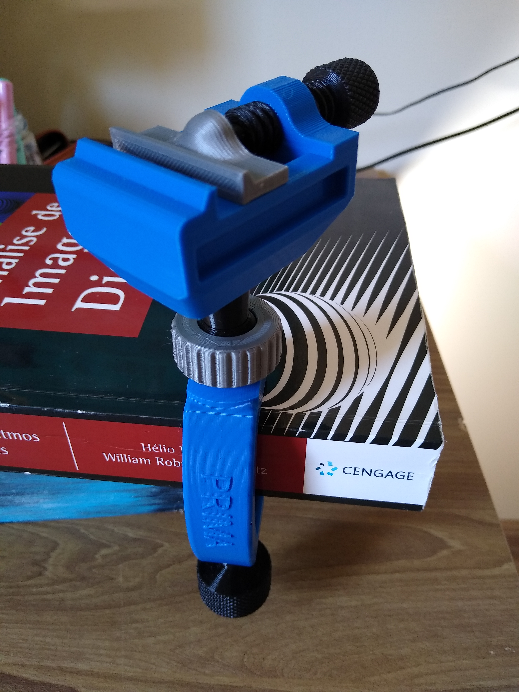
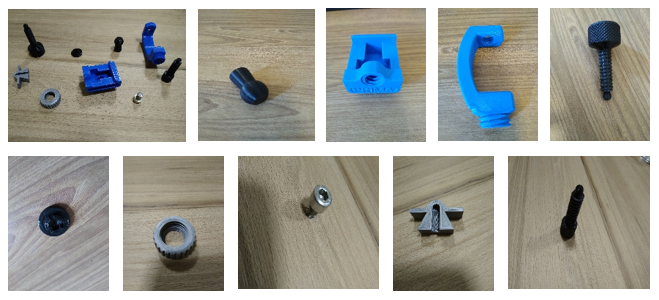

# `Aumento de imagens usando modelos generativos profundos`
# `Image augmentation using deep generative models`

## Apresentação

O presente projeto foi originado no contexto das atividades da disciplina de pós-graduação *IA376L - Deep Learning aplicado a Síntese de Sinais*, 
oferecida no primeiro semestre de 2022, na Unicamp, sob supervisão da Profa. Dra. Paula Dornhofer Paro Costa, do Departamento de Engenharia de Computação e Automação (DCA) da Faculdade de Engenharia Elétrica e de Computação (FEEC).

|Nome  | RA | Especialização|
|--|--|--|
| Pedro A. Vicentini Fracarolli  | 191535  | Analista de Sistemas|
| Mariana Zaninelo Reis| 223752  | Eng. Eletricista|
| Matheus Henrique Soares Pinheiro  | 223988  | Eng. Eletricista|

## Descrição Resumida do Projeto
A síntese de sinais por meio de técnicas de deep learning é uma área de estudo que pode ser fragmentada em várias outras como síntese de áudio, texto e imagem cada uma possuindo suas técnicas e desafios particulares.  

Neste projeto nosso grupo irá se aprofundar em síntese de imagens utilizando dados próprio, a integrante Mariana Zaninelo possui um conjunto de dados que será utilizado no decorrer da disciplina e do seu mestrado, conjunto esse constituído de 3000 imagens de impressões 3D de peças de uma mini morsa.  

Pretendemos treinar um modelo que ajude a expandir este conjunto de dados por meio de dados sintéticos (*data augmentation*) e com o novo conjunto de dados obtido treinar modelos que generalizem melhor em tarefas como classificação, detecção de objetos e outras.  

Inicialmente buscamos selecionar um modelo de GAN (*generative adversarial networks*) que desempenhem bem em um conjunto de dados limitado (*few-shot learning*) e nos forneça amostras estatisticamente condizentes com o nosso conjunto de dados original.

[Endereço do vídeo para a apresentação da proposta inicial.](https://www.youtube.com/watch?v=Bqvy9ZJnfk0)

## Metodologia Proposta

### Base de dados

Para este trabalho, pretende-se utilizar uma base de dados própria, que corresponde às imagens de peças que formam uma mini morsa de bancada, conforme ilustrado abaixo:

O dataset é originalmente composto por 3000 imagens divididas em 10 classes balanceadas. A figura a seguir ilustra as classes que compõem o dataset:

O dataset pode ser acessado através do seguinte hyperlink: 

[Dataset](https://drive.google.com/drive/folders/1efljm3fsSU5jd3i0lw46e7y_rgYrkCuo?usp=sharing)

A motivação para a escolha desse conjunto de dados se deu por alguns fatores, sendo eles:

* Não é um conjunto de dados conhecido, possibilitando-nos avaliar os resultados de modelos generativos em uma aplicação mais "real".

* É constituído por imagens de objetos 3D, assim poderemos avaliar o comportamento dos modelos nesse caso, uma vez que pode apresentar um nível maior de complexidade na geração de imagens realistas.

* Originalmente é um conjunto de dados pequeno, viabilizando-nos a análise do desempenho de modelos generativos nesse tipo de cenário.

* Pelo conjunto estar organizado por classes a avaliação dos resultados pode ser mais simples em comparação com as análises subjetivas.

### Abordagens

A princípio pretendemos realizar testes com GANs.

### Artigos de referência

Para os testes com GANs, o artigo [Towards Faster and Stabilized GAN Training for High-fidelity Few-shot Image Synthesis](https://arxiv.org/abs/2101.04775) parece ser bastante útil para o problema em questão, uma vez que aborda a síntese de imagens a partir de um conjunto de dados reduzido.

### Ferramentas

Para este trabalho, pretendemos usar o [PyTorch](https://pytorch.org/) como framework principal, bem como bibliotecas relacionadas a serem definidas ao longo do projeto. O código será desenvolvido no [Google Colab](https://colab.research.google.com/).

### Resultados esperados

É esperado que sejam geradas imagens condizentes com a base de dados original, levando em consideração as classes, ou seja, que ainda seja possível classificar as imagens geradas sinteticamente de maneira correta. Além do uso de modelos generativos, pretendemos avaliar a utilização de algumas técnicas de processamento de imagens com o intuito de melhorar os resultados, como a aplicação de filtros nas imagens de saída.

### Proposta de avaliação

Para a avaliação dos resultados, pretendemos utilizar um classificador treinado na base de dados original, uma vez que o conjunto de dados já está organizado por classes, e realizar testes com a base de dados gerada a partir do(s) modelo(s) generativo(s). A predição das classes corretas das amostras sintéticas nos indicaria que elas foram suficientemente boas para o propósito.

## Cronograma
|                         |27/04|04/05|11/05|18/05|25/05|02/06|09/06|16/06|23/06|30/06
|-------------------------------|-----|-----|-----|-----|-----|-----|-----|-----|-----|-----
|Revisão Bibliográfica          |X    |    X|    X|    0|    0|     |     |     |     |
|Implementação GAN              |     |     |    X|    #|    #|    #|    #|     |     | 
|Implementação Classificador    |     |     |     |    X|    #|    #|    #|    #|     |
|Implementação Heatmap          |     |     |     |    X|    #|    #|    #|    #|     |
|Relatório Final & Apresentação |     |     |     |     |     |     |     |     |    #|#

- `#` Tempo Planejado
- `X` Tempo Consumido
- `0` Tempo Consumido Além do Esperado    

## Referências Bibliográficas
* [Generative Adversarial Nets](https://arxiv.org/abs/1406.2661)
* [Unsupervised Representation Learning with Deep Convolutional Generative Adversarial Networks](https://arxiv.org/abs/1511.06434)
* [Improved Techniques for Training GANs](https://arxiv.org/abs/1606.03498)
* [Spectral Normalization for Generative Adversarial Networks](https://arxiv.org/abs/1802.05957)
* [The Unusual Effectiveness of Averaging in GAN Training](https://arxiv.org/abs/1806.04498)
* [The Unreasonable Effectiveness of Deep Features as a Perceptual Metric](https://arxiv.org/abs/1801.03924)
* [Differentiable Augmentation for Data-Efficient GAN Training](https://arxiv.org/abs/2006.10738)
* [Towards Faster and Stabilized GAN Training for High-fidelity Few-shot Image Synthesis](https://arxiv.org/abs/2101.04775)
* [GANs Trained by a Two Time-Scale Update Rule Converge to a Local Nash Equilibrium](https://arxiv.org/abs/1706.08500)
* [An Introduction To Variational Autoencoders](https://arxiv.org/pdf/1906.02691.pdf)
* [Auto-encoding Variational Bayes](https://arxiv.org/pdf/1312.6114v10.pdf)
