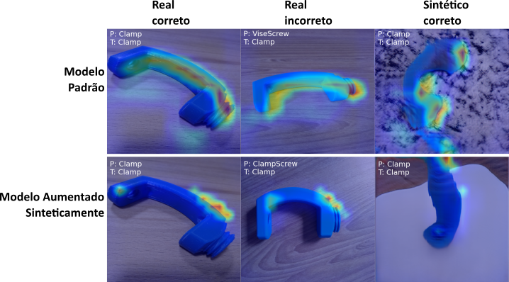

# `Aumento de imagens usando modelos generativos profundos`
# `Image augmentation using deep generative models`

## Apresentação

O presente projeto foi originado no contexto das atividades da disciplina de pós-graduação *IA376L - Deep Learning aplicado a Síntese de Sinais*, 
oferecida no primeiro semestre de 2022, na Unicamp, sob supervisão da Profa. Dra. Paula Dornhofer Paro Costa, do Departamento de Engenharia de Computação e Automação (DCA) da Faculdade de Engenharia Elétrica e de Computação (FEEC).

|Nome  | RA | Especialização|
|--|--|--|
| Pedro A. Vicentini Fracarolli  | 191535  | Analista de Sistemas|
| Mariana Zaninelo Reis| 223752  | Eng. Eletricista|
| Matheus Henrique S. Pinheiro  | 223988  | Eng. Eletricista|

## Resumo (Abstract)
Neste projeto exploramos o aumento de um conjunto de dados através de amostras sintéticas - visando melhorar o desempenho de algoritmos que utilizem esse conjunto de dados aumentado. Contudo na realização deste projeto lidamos com dois grandes desafios: a baixa quantidade dados disponível para o treinamento de um modelo generativo e consequentemente como avalia-lo. Solucionamos esses desafios com a utilização de uma arquitetura GAN especializada em tarefas de *few-shot learning* e com métricas de classificação de uma rede neural convolucional juntamente com a visualização de gradientes por meio da técnica Grad-CAM, que nos auxilio a entender o aprendizado da rede convolucional.
## Descrição do Problema/Motivação
Modelos generativos profundos atualmente fazem grande sucesso devido aos seus resultados em áreas como geração de texto, áudio e imagens. Porém, analisando o desenvolvimento desses modelos conseguimos perceber a necessidade de treiná-los com uma enorme quantidade de dados e mesmo assim eles podem não sintetizar amostras representativas da distribuição alvo.

Com isso em mente decidimos trabalhar com um pequeno conjunto de dados próprio, usando-o para treinar um modelo que produza amostras sintéticas e por meio dessas amostras expandir o nosso conjunto de dados.  

Buscamos que as amostras sintetizadas sejam representativas da distribuição original e provém-se úteis no aprimoramento de modelos que utilizem o nosso conjunto de dados.

## Objetivo
Nosso grupo teve como meta expandir um pequeno conjunto de dados por meio de amostras sintéticas que sejam estatisticamente semelhantes ao conjunto de dados original, para isso: 
* Amostramos dados sintéticos por meio de uma rede generativa profunda a [GAN](https://arxiv.org/abs/1406.2661);
* Avaliamos os dados gerados por meio de classificações com redes neurais convolucionais (CNNs);
* Avaliamos as propriedades dos dados gerados por meio de uma técnica de gradientes a [Grad-CAM](https://arxiv.org/abs/1610.02391).

## Metodologia Proposta

### **Base de dados**

Para este trabalho, utilizamos uma base de dados própria que corresponde a imagens de peças que formam uma mini morsa de bancada, conforme ilustrado abaixo:

|  |
|:--:| 
| Figura 1 - Mini morsa de bancada montada.   Fonte: Imagem própria. |

O conjunto de dados é originalmente composto por 3000 imagens divididas em 10 classes balanceadas. A figura a seguir ilustra as classes que compõem o nosso conjunto de dados:

|  |
|:--:|
| Figura 2 - Amostra da base de dados.   Fonte: Imagem própria. |

O conjunto de dados pode ser acessado através do seguinte hyperlink: [Imagens](https://drive.google.com/drive/folders/1efljm3fsSU5jd3i0lw46e7y_rgYrkCuo?usp=sharing).

A motivação para a escolha desse conjunto de dados se deu por alguns fatores, sendo eles:

* Não é um conjunto de dados popular e/ou altamente disponível online, possibilitando-nos avaliar os resultados de modelos generativos em uma aplicação mais vero.

* Originalmente é um conjunto de dados pequeno, viabilizando-nos a análise do desempenho de modelos generativos nesse tipo de cenário.

* Devido ao conjunto de dados estar rotulado podemos usar métodos de avaliação mais objetivos.

### **Abordagem**

O presente trabalho foi realizado em três etapas, sendo elas:

**1) Síntese dos dados**: para amostrarmos e expandirmos o nosso conjunto de dados utilizamos uma arquitetura de GAN conhecida como [FastGAN](https://arxiv.org/abs/2101.04775). Entre as diversas arquiteturas de modelos generativos profundo a FastGAN destacou-se por ser uma arquitetura que opera com poucos dados e não exige muito poder computacional para a sua convergência.

**2) Classificação**: Treinamos uma série de CNNs a partir das imagens e de seus rótulos. Mais explicitamente, avaliamos os efeitos de 1. treinar um classificador somente nos dados originais; 2. treinar com os dados originais e técnicas tradicionais de aumento de dados; e 3. treinar com os dados originais e com os dados sintéticos.

**3) Visualização do aprendizado das CNNs**: Uma vez treinada as CNNs aplicamos a [Grad-CAM](https://arxiv.org/abs/1610.02391), uma técnica que nos possibilita visualizar as regiões da imagem mais relevantes para a decisão do classificador.

### **Avaliação**

Dada a abordagem acima, avaliamos os resultados do nosso experimento por meio de técnicas de classificação em que medimos a acurácia das CNNs e posteriormente as confrontamos com as visualizações obtidas por meio da técnica Grad-CAM. Buscamos padrões que relacionem a acurácia e a atenção das CNNs para inferirmos se as amostras sintetizadas possuem as propriedades estatísticas do nosso conjunto de dados.

### **Ferramentas**

Para este trabalho, utilizamos o [PyTorch](https://pytorch.org/) como framework principal e desenvolvemos o código no ambiente [Google Colab](https://colab.research.google.com/).

## Resultados e Discussão
Abaixo dividimos a seção em três partes para abordar melhor a cronologia de desenvolvimento de cada etapa do projeto.

### **1) GANs**
Adaptando a arquitetura da FastGAN para as nossas necessidades conseguimos treinar cada classe do nosso conjunto de dados individualmente. Algumas amostras podem ser visualizadas abaixo:

|  |
|:--:|
| Figura 3 - Amostra geradas.   Fonte: Imagem própria. |

O interessante é que como o gerador da GAN é uma função contínua pequenas mudanças na entrada geram pequenas mudanças na saída e isso pode ser aproveitado como uma forma de gerar distúrbios e variações de imagens, além de mostrar a capacidade de amostragam que o modelo proporciona.

| |
|:--:|
| Figura 5 - Interpolação linear do Nut e Clamp no espaço latente do gerador.   Fonte: Imagem própria. |

Por fim as amostras obtidas da rede generativa lembram a estrutura da classe à qual cada uma pertence, porém elas são facilmente distinguíveis como sendo imagens falsas devido a fatores como formas distorcidas, padrão de cores e etc. Contudo, neste trabalho não tivemos o objetivo de gerar amostras fidedignas em aspectos visuais, mas sim amostras que tragam as propriedades estatísticas das nossas classes para que elas sejam úteis no aumento do nosso conjunto de dados.

### **2) Classificação**
Para avaliarmos o desempenho das amostras sintéticas em outros modelos treinamos duas CNNs: [VGG16](https://arxiv.org/abs/1409.1556) e [MobileNetV3](https://arxiv.org/abs/1905.02244). As duas redes foram treinadas com os dados originais e com o acréscimo de dados sintéticos em várias proporções, conforme mostra a imagem abaixo.
||
|:--:|
| Figura 4 - Performance de treinamento da MobileNetV3.   Fonte: Imagem própria. |

Em ambas as redes foi notado um mesmo padrão de comportamento em que a adição de poucos dados sintéticos deteriorou o treinamento (por volta de 20%) enquanto mais dados ajudaram a rede. Porém, parece haver um limiar onde mais dados não aprimoram tanto o desempenho das redes, pois com o acréscimo 75% de dados sintéticos a acurácia da rede era de 84% e a versão com 125% de dados sintéticos teve um aumento de apenas 2% na acurácia.

### **3) Grad-CAM**
Para observarmos os efeitos que os dados sintéticos geram no nosso conjunto de dados utilizamos a Grad-CAM, a qual é uma técnica baseada no gradiente da ultima camada convolucional de uma CNN e nos fornece um mapa de calor que permite visualizarmos as regiões da imagem mais relevantes para o classificador.  Com a imagem abaixo podemos ver alguns exemplos da aplicação desse método.
||
|:--:|
| Figura 5 - Método Grad-CAM aplicado ao nosso modelo padrão e aumentado (MobileNetV3 2625 amostras sintéticas).   Fonte: Imagem própria. |

Na primeira linha da Figura 5 podemos ver alguns resultados do método Grad-CAM aplicado ao nosso modelo padrão, treinado apenas com as imagens reais, e percebemos que as regiões que o classificador usa em sua tomada de decisão são bem amplas, até mesmo quando adicionamos uma imagem sintética que o classificador nunca viu. Porém, no segundo exemplo, aplicamos o método Grad-CAM a um modelo treinado com a inclusão de dados sintéticos, e notamos que as regiões que o classificador utiliza em sua tomada de decisão são bem restritas.  

Esse resultado nos traz algumas reflexões sobre o uso de dados sintéticos no treinamento de um modelo, pois o modelo treinado com dados sintético é mais acurado que o treinado apenas com dados reais, e isso pode indicar que os dados sintéticos refinam o modelo classificativo pois trazem as características únicas de cada classe e fazem com que o classificador torne-se mais preciso em detalhes únicos de cada classe.

## Conclusão(EM ANDAMENTO)
A síntese de imagens utilizando um conjunto de dados pequeno e poder computacional limitado é uma tarefa difícil, ainda mais quando o objetivo é obter dessas amostras sintetizadas propriedades que nos permita adiciona-lás de volta ao nosso conjunto de dados para aumenta-lo de maneira benigna. Para alcançarmos isso dividimos o trabalho em três partes: síntese, aplicação e entendimento.  

Na parte de síntese adaptamos as nossas necessidades uma arquitetura conhecida como FastGAN, a qual foi capaz de produzir imagens com conteúdos visuais coerentes para cada classe e uma ampla gama de possibilidades de amostragem que inclui imagens com variações de forma, pose e local.  

Na segunda parte buscamos uma aplicação ao nosso conjunto de dados aumentado para tentarmos quantificar os efeitos dos dados sintéticos, assim aproveitamos que os dados são rotulados e treinamos diversas CNNs em que conseguimos constatar que a adição de amostra sintéticas teve um efeito positivo.  

A última etapa foi para entendermos os efeitos que os dados sintéticos geraram sobre os nossos classificadores, para isso usamos a Grad-CAM e visualizamos as regiões mais importantes da tomada de decisão das CNNs e notamos que os dados sintéticos fazem o classificador ter uma área mais restrita para a sua tomada de decisão, focando em pequenos detalhes apenas.  

Juntando as informações de cada etapa temos que as amostras geradas pela GAN aprimorou o desempenho das redes classificativas e alterou também o seu padrão de tomada de decisão, isso indica que as amostras sintetizadas trouxeram as propriedades das amostras reais e podem ser benéficas para o aumento de um conjunto de dados que será utilizado em outras aplicações.  

Todavia o efeito de restringir a área de tomada de decisão da CNN foi o que mais nos chamou a atenção, pois isso poderia indicar que as amostras sintetizadas não possuem em sí uma grande estrutura que remete as amostras reais e sim pequenas estruturas únicas de cada classe, como também poderia indicar que o acréscimo de variabilidade obtido das amostras sintéticas faria o classificador se tornar mais apto a distinguir os detalhes únicos que cada classe apresenta. Isso é algo que possa vir a ser estudado mais afundo e que exigiria uma outra metodologia para associar os efeitos de um modelo generativo profundo ao aprendizado de um modelo que use esses dados.

## Cronograma
|                         |27/04|04/05|11/05|18/05|25/05|02/06|09/06|16/06|23/06|30/06
|-------------------------------|-----|-----|-----|-----|-----|-----|-----|-----|-----|-----
|Revisão Bibliográfica          |X    |    X|    X|    0|    0|     |     |     |     |
|Implementação GAN              |     |     |    X|    #|    #|    #|    #|     |     | 
|Implementação Classificador    |     |     |     |    X|    #|    #|    #|    #|     |
|Implementação da Grad-CAM          |     |     |     |    X|    #|    #|    #|    #|     |
|Relatório Final & Apresentação |     |     |     |     |     |     |     |     |    #|#

- `#` Tempo Planejado
- `X` Tempo Consumido
- `0` Tempo Consumido Além do Esperado  

## Fontes Bibliográficas
* [Generative Adversarial Nets](https://arxiv.org/abs/1406.2661)
* [Unsupervised Representation Learning with Deep Convolutional Generative Adversarial Networks](https://arxiv.org/abs/1511.06434)
* [Self-Attention Generative Adversarial Networks](https://arxiv.org/abs/1805.08318)
* [Improved Techniques for Training GANs](https://arxiv.org/abs/1606.03498)
* [Spectral Normalization for Generative Adversarial Networks](https://arxiv.org/abs/1802.05957)
* [The Unusual Effectiveness of Averaging in GAN Training](https://arxiv.org/abs/1806.04498)
* [The Unreasonable Effectiveness of Deep Features as a Perceptual Metric](https://arxiv.org/abs/1801.03924)
* [Differentiable Augmentation for Data-Efficient GAN Training](https://arxiv.org/abs/2006.10738)
* [Towards Faster and Stabilized GAN Training for High-fidelity Few-shot Image Synthesis](https://arxiv.org/abs/2101.04775)
* [GANs Trained by a Two Time-Scale Update Rule Converge to a Local Nash Equilibrium](https://arxiv.org/abs/1706.08500)
* [Batch Normalization: Accelerating Deep Network Training by Reducing Internal Covariate Shift](https://arxiv.org/abs/1502.03167)
* [Language Modeling with Gated Convolutional Networks](https://arxiv.org/abs/1612.08083)
* [Searching for MobileNetV3](https://arxiv.org/abs/1905.02244)
* [Very Deep Convolutional Networks for Large-Scale Image Recognition](https://arxiv.org/abs/1409.1556)
* [Grad-CAM](https://arxiv.org/abs/1610.02391)

## Apêndice

### **A** &nbsp; &nbsp; &nbsp; &nbsp; Seleção do modelo de GAN

A síntese de imagens representativas do nosso conjunto de dados foi o problema central do trabalho, e para resolve-la foram necessárias várias experimentações até alcançarmos o modelo final.

Inicialmente no trabalho testamos diferentes modelos generativos como GANs, *Autoenconders* e *Variational Autoenconders*, entretanto não conseguimos obter de nenhum deles amostras fidedignas da nossa distribuição de dados. Porém, analisando os resultados obtidos da GANs, percebemos que elas tentavam aproximar a nossa distribuição alvo contudo não conseguiam convergir a ela.
|  |
|:--:| 
| Figura 6 - Deep Convolutional GAN, época 9.   Fonte: Imagem própria. |

|  |
|:--:| 
| Figura 7 - Deep Convolutional GAN, época 23.   Fonte: Imagem própria. |

|  |
|:--:| 
| Figura 8 - Deep Convolutional GAN, época 39.   Fonte: Imagem própria. |

Dado essa observação fomos mais afundo na literatura de GANs e encontramos diversas arquiteturas e técnicas que nos motivou a continuar com elas. Abaixo deixamos uma pequena linha do tempo sobre o desenvolvimento das GANs utilizadas.

### 1) Deep Convolutional GAN

Nos primeiros testes desenvolvemos uma GAN com arquitetura convolucional, inspirando nos fortemente em [Unsupervised Representation Learning with Deep Convolutional Generative Adversarial Networks](https://arxiv.org/abs/1511.06434). Entretanto apenas as arquiteturas de maiores resoluções como $512^2$ e $1024^2$ pixeis demonstraram resultados, e mesmo assim eram todos semelhantes aos das figuras 6, 7, e 8. Além do mais o treinamento era muito instável, devido a escolha de hiperparâmetros e do discriminador que em poucas épocas distinguia facilmente entre as amostras reais e sintéticas - consequentemente afetando os gradientes necessários para a atualização das redes. Tentando resolver esses problemas somos levados a próxima etapa.

### 2) Função de perda, ajustes de hiperparâmetros e técnicas de treinamento

Para lidar com os problemas anteriores tentamos algumas modificações nas redes que compõem a GAN, sendo elas:

* Testar várias funções de perda;
* Testar hiperparâmetros e otimizadores;
* Manipular a arquitetura e o modo de treinamento.

E como resultado notamos que:

* As diferentes funções de perda não afetaram a dinâmica de treinamento;
* O otimizador ADAM demonstrou-se ser o mais estável utilizando betas de (0.5, 0.999) ou (0, 0.9) e as taxas de aprendizado de ([0.0001, 0.0004](https://arxiv.org/abs/1706.08500)) para o gerador e discriminador respectivamente. O uso de técnicas como decaimento de taxa de aprendizado degradaram o desempenho dos modelos.  
* No gerador Nearest Upsampling seguido de Conv2d apresentou resultados semelhantes a Transposed Convolution 2D seguido de Conv2d, mas os recursos computacionais gastos foram menores. Já para funções de ativações a LeakyReLU apresentou um treinamento mais estável que a ReLU.  

Por fim, técnicas como treinar o gerador ou discriminador mais vezes que o outro ou penalizar o discriminador por ser muito confiante em sua predição também deteriorou o treinamento das redes.  

Feito todos esses testes não obtivemos um modelo com uma síntese satisfatória, então partimos para um outra arquitetura.

### 3) FastGAN

Após pesquisar modelos que não demandem grande poder computacional ou enormes quantidades de dados chegamos a [FastGAN](https://arxiv.org/abs/2101.04775), a qual é uma arquitetura que pode produzir imagens de alta resolução e se diferencia das outras GANs por possuir um gerador que faz uso de skip-layer excitation  

|  |
|:--:| 
| Figura 9 - FastGAN gerador.   Fonte: Towards Faster and Stabilized GAN Training for High-fidelity Few-shot Image Synthesis. |

e um discriminador que recebe dois autoenconders como forma de regularização e tem como saída um mapa de características $5^2$ em que se computa a soft hinge loss.

|  |
|:--:| 
| Figura 10 - FastGAN discriminador.   Fonte: Towards Faster and Stabilized GAN Training for High-fidelity Few-shot Image Synthesis. |

Com o uso dessa arquitetura obtivemos um treinamento estável. Acreditamos que isso ocorra devido as *skip-layer excitation* fornecendo gradientes maiores a todas as camadas do gerador e aos autoenconders que regularizam o discriminador e propiciam uma dinâmica de treinamento estável e ainda codificam uma versão das amostras reais e de suas texturas, conforme podemos ver na imagem abaixo.

|  |
|:--:| 
| Figura 11 - FastGAN Discriminador.   Fonte: Imagem própria. |

Contudo, dado o nosso poder computacional, o modelo se manteve lento para treinar e sofria de alguns *mode collapse*. Para solucionarmos isso realizamos modificações como substituir funções de ativação por LeakyReLU, usar taxas de aprendizado diferentes e por fim adicionamos uma [convolutional self-attention](https://arxiv.org/abs/1805.08318) nas redes, tudo isso permitiu um treinamento com um batch size maior e mais diversidade de amostras geradas.

### **B** &nbsp; &nbsp; &nbsp; &nbsp; Treinamento dos classificadores
Após treinarmos a GAN nos valemos que os nossos dados são rotulados e decidimos treinar um classificador para tentarmos avaliar a qualidade dos dados gerados. Ao longo do projeto utilizamos duas redes convolucionais a VGG16 e a MobileNetV3, as duas redes apresentaram o mesmo padrão de comportamento. 

De inicio dividimos os nossos dados reais em dois conjuntos:
* **Treino**: 2100 amostras ou seja 70% dos nossos dados para o treinamento dos modelos;
* **Teste**: 900 amostras ou seja 30% para avaliarmos o desempenho dos modelos;
* Devido a fatores como tamanho do conjunto de dados, poder computacional e tempo decidimos que não usaríamos um conjunto de validação.

Começamos os experimentos com uma CNN pré-treinada no ImageNet para os dados reais, conforme ilustra a figura 12.

|  |
|:--:| 
| Figura 12 - Performance da rede VGG16 pré-treinada aos nossos dados.   Fonte: Imagem própria. |

Utilizando uma rede pré-treinada em poucas iterações tivemos dois resultados notáveis  
* 1) A acurácia do conjunto de treinamento saturou em um limiar variação de 93% a 95%;
* 2) A acurácia do conjunto de teste tornou-se constante em 94%.  

Talvez pelo fato dos nossos dados não possuírem muitas variações entre as imagens de cada classe uma rede pré-treinada pode ser muito "potente" para o nosso conjunto de dados e não permitir que avaliemos os efeitos de amostras sintéticas quando adicionadas ao treinamento, dado tudo isso vamos avaliar o desempenho de uma rede treinada do zero.  

Treinando então uma rede inicializada aleatoriamente com os dados reais e uma versão com alguns aumentos como color jitter, rotação horizontal aleatória e ruído gaussiano tivemos os seguintes resultados vistos na figura 13.

||
|:--:|
| Figura 13 - Acurácia por iteração do conjunto de teste - rede treinada apenas com dados reais e sua versão aumentada por técnicas convencionais.   Fonte: Imagem própria. |

Na figura acima podemos ver que a versão aumentada dos dados possui um desempenho inferior a versão original dos dados, uma explicação seria que com os aumentos criaríamos novas características intraclasse e extraclasse no conjunto e isso degradaria os padrões únicos que a rede poderia aprender.

Adicionando agora os dados sintéticos e treinando a rede com várias proporções deles, temos os seguintes resultados

||
|:--:|
| Figura 14 - Acurácia por iteração do conjunto de teste - adicionando várias proporções de dados sintéticos ao conjunto de treino.   Fonte: Imagem própria. |

Esses resultados da Figura 14 e os da Figura 15 abaixo foram discutidos na seção Resultados e Discussão e podem ser comparados diretamente com os resultados da Figura 4.

||
|:--:|
| Figura 15 - Performance de treinamento da VGG16.   Fonte: Imagem própria. |

### **C** &nbsp; &nbsp; &nbsp; &nbsp; Detalhamento dos resultados do Grad-CAM
Na seção Resultados e Discussão abordamos o método Grad-CAM mas deixamos aqui algumas imagens para uma visualização e interpretação mais detalhada dos resultados.

||
|:--:|
| Figura 16 - Grad-CAM do modelo baseline (MobileNetV3) em amostras reais classificadas corretamente. **T** representa o rótulo real e **P** é o rótulo predito.   Fonte: Imagem própria. |

||
|:--:|
| Figura 17 - Grad-CAM do modelo baseline (MobileNetV3) em amostras reais classificadas incorretamente.   Fonte: Imagem própria. |

||
|:--:|
| Figura 18 - Grad-CAM do modelo baseline (MobileNetV3) em amostras geradas classificadas corretamente.   Fonte: Imagem própria. |

||
|:--:|
| Figura 19 - Grad-CAM do modelo baseline (MobileNetV3) em amostras geradas classificadas incorretamente.   Fonte: Imagem própria. |

||
|:--:|
| Figura 20 - Grad-CAM do melhor modelo aumentado (125%) em amostras reais classificadas corretamente.   Fonte: Imagem própria. |

||
|:--:|
| Figura 21 - Grad-CAM do melhor modelo aumentado (125%) em amostras reais classificadas incorretamente.   Fonte: Imagem própria. |

||
|:--:|
| Figura 22 - Grad-CAM do melhor modelo aumentado (125%) em amostras geradas classificadas corretamente.   Fonte: Imagem própria. |

||
|:--:|
| Figura 23 - Grad-CAM do melhor modelo aumentado (125%) em amostras geradas classificadas incorretamente   Fonte: Imagem própria. |